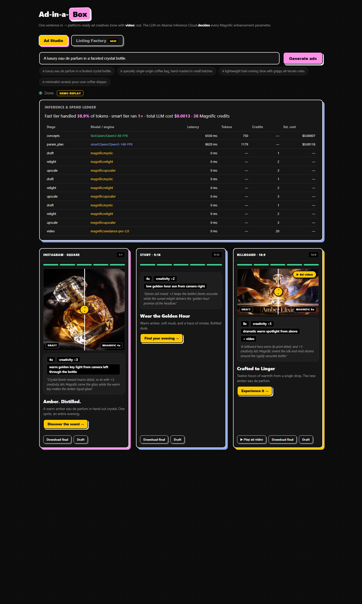
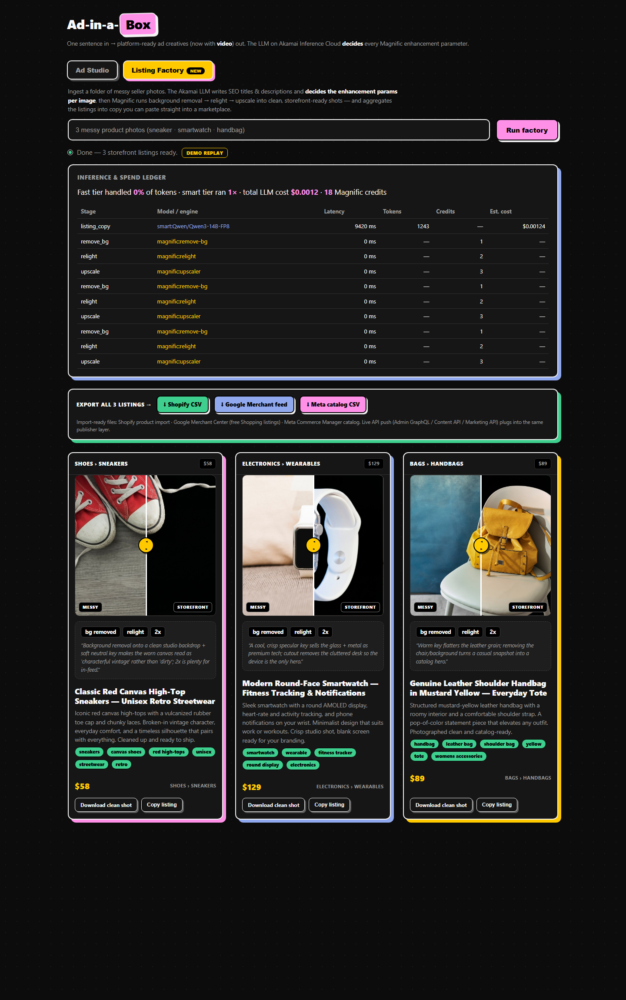
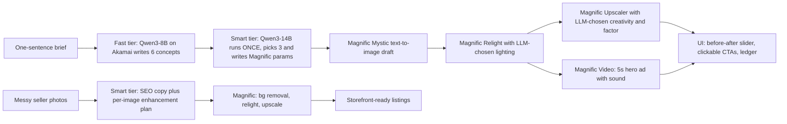

# 📦 Ad-in-a-Box — one sentence in, a full ad campaign out

**Akamai Inference Cloud decides. Magnific renders.**

Built for the **AI Inference Hack Day @ AWS Builder Loft SF** — targeting the Akamai 1st-place prize and Best Use of Magnific.

> **💎 The pitch:** Ad-in-a-Box turns one sentence into a finished multi-channel ad campaign — copy, platform-sized images, and a sound-on hero video — in under two minutes, for a tenth of a cent of LLM spend. The trick: a two-tier pipeline on **Akamai Inference Cloud** acts as the *art director, not the artist* — a cheap fast model drafts the creative, a strong model runs **exactly once** to write a typed **Magnific** parameter plan (image prompt, light direction, creativity dial, upscale factor — each with a one-sentence rationale), and Magnific's five engines execute it. The same decide→render engine powers an **E-commerce Listing Factory** that turns messy seller photos into storefront-ready listings with SEO copy — one export away from Shopify, Google Shopping, and Meta catalogs. Every token and credit is itemized in a live ledger; budget caps, graceful degradation, and offline replay of real output kept it shipping even when the venue Wi-Fi and the workshop gateway died mid-hack. It isn't a wrapper — it's a pattern for making expensive generative pixels a deliberate, priced decision.

Type one sentence describing a product. A two-tier LLM pipeline on **Akamai Inference Cloud** writes the campaign and — this is the core idea — **decides every Magnific enhancement parameter** (image prompt, light direction, creativity dial, upscale factor) per channel. **Magnific** then executes: text-to-image → relight → upscale → even a 5-second hero **ad video** with sound. A second feature, the **E-commerce Listing Factory**, turns messy seller photos into storefront-ready listings with LLM-written SEO copy.

---

## 🎬 See it working

### Ad Studio — one brief → 3 channel-ready creatives (+ video)


### Real Magnific hero ad videos (image → video, with sound)
| Coffee | Trail shoe | Perfume |
|---|---|---|
|  |  |  |

*Full-quality MP4s with audio are committed in the repo: [`coffee`](backend/static/runs/demo_coffee/c6_video.mp4) · [`shoe`](backend/static/runs/demo_shoe/c6_video.mp4) · [`perfume`](backend/static/runs/demo_perfume/c6_video.mp4)*

### The Magnific before/after (draft → LLM-directed relight + upscale)


### E-commerce Listing Factory — messy seller photo → storefront listing



---

## 🧠 How we use Akamai Inference Cloud

Two right-sized models, **tiered by cost**, on an OpenAI-compatible endpoint:

| Tier | Model | Runs | Job | Why this tier |
|---|---|---|---|---|
| **fast** | `Qwen/Qwen3-8B-FP8` | per run | Writes **6 ad concepts** (headline, body, CTA, visual concept) — the token-heavy creative drafting | Cheap tokens for bulk work |
| **smart** | `Qwen/Qwen3-14B-FP8` | **exactly once** | Picks the best 3 concepts and emits a **structured Magnific parameter plan** per creative | One expensive, high-judgment call |

The smart tier's output is a strict-JSON `ParamPlan` — the contract between the LLM and Magnific:

```json
{
  "concept_id": "c6",
  "image_prompt": "Wide cinematic shot of a luxury faceted crystal perfume bottle…",
  "aspect_ratio": "wide_16_9",
  "relight_prompt": "dramatic warm spotlight from above, deep shadows, amber glow through the glass",
  "creativity": 5,
  "upscale_factor": "8x",
  "rationale": "A billboard hero earns 8x print detail, and +5 creativity lets Magnific invent the silk-and-mist drama around the rigidly accurate bottle."
}
```

**The live inference ledger** (visible in the UI on every run) proves the economics:

> Fast tier handled **38.9%** of tokens · smart tier ran **1×** · total LLM cost **$0.0013** · 38 Magnific credits

Every stage is itemized: model, latency, tokens, credits, estimated cost. A whole campaign's LLM bill is **about a tenth of a cent**.

**Engineering details that make this production-ish, not demo-ware:**
- OpenAI-compatible client ([`backend/llm.py`](backend/llm.py)) works against Akamai Inference Cloud or any compatible endpoint; strict-JSON extraction with reasoning-model `<think>` stripping and a one-shot cheap-tier **JSON repair pass** on parse failure
- When the venue gateway died mid-hackathon, we **self-provisioned a replacement inference box on Akamai Connected Cloud** via the API — the pipeline is endpoint-portable by design

## 🎨 How we use Magnific

Five engines, all driven by LLM-chosen parameters:

| Engine | Used for | The LLM decides |
|---|---|---|
| **Mystic (text-to-image)** | Draft creative per channel | The full image prompt + aspect ratio |
| **Relight** | Channel-specific mood lighting | Light **direction, quality, color temperature** ("warm golden-hour key from camera left, amber rim light") |
| **Upscaler** | Final 4x–8x print/feed-ready asset | **Creativity** (−10…+10: negative = product accuracy, positive = reinvented detail) + **factor** per channel (billboard→8x, story/square→4x) |
| **Background removal** | Listing Factory cleanup | Whether to cut the product out of its messy scene |
| **Video (Seedance Pro 2.0)** | 5s 1080p hero **ad videos** with sound effects | — (seeded from the relit hero frame + camera push-in) |

Pipeline per creative: `generate → relight → upscale` (+ `video` for the billboard hero).
Pipeline per listing: `remove background → studio relight → upscale` + SEO title/description/tags/category/price.

## 🏗 Architecture



- **Backend:** FastAPI + httpx, async pipeline with per-creative concurrency (semaphore-bounded), in-memory run store, polling API (`POST /run`, `GET /run/{id}`, `POST /listings`, `GET /listings/{id}`)
- **Frontend:** single static HTML file, zero build step — dark neo-brutalist UI with before/after sliders, video player, landing-page modals, live progress steps, and the inference ledger
- **Data contracts:** Pydantic models ([`backend/models.py`](backend/models.py)) shared by the LLM stages, Magnific stages, API, and UI

## 🛡 Cost & failure engineering (built in, not bolted on)

- **`MAX_MAGNIFIC_CALLS_PER_RUN`** — hard budget cap on billable Magnific calls per run
- **`LIVE_MAX_UPSCALE=4x`** — live runs clamp the 8x money-shot to 4x to control credit burn; 8x lives in the cached demo
- **Graceful degradation** — any image-stage failure degrades that one creative (keeps the best image it has) and never aborts the run; the UI shows a ⚠ degraded note
- **`DEMO_MODE=1`** — replays pre-baked runs of **real captured Magnific output** instantly and fully offline (venue-Wi-Fi insurance). The Wi-Fi did die mid-hackathon; the demo didn't.
- **JSON repair pass** — malformed LLM JSON gets one cheap-tier repair call instead of failing the run

## ✅ What's real (transparency for judges)

- **All 9 campaign images and all 3 ad videos are real Magnific API output** — generate → relight → upscale chains, no mockups. The 4x/8x originals run up to 10,880px; web-sized copies are committed for a snappy UI.
- **All 3 Listing Factory transformations are real Magnific output** (background removal → relight → upscale) on real stock "messy" photos.
- **Coffee & shoe campaign concepts/params came verbatim from live Akamai Qwen3 runs** — captured with real token counts, latencies, and costs in [`scripts/_live_plans.json`](scripts/_live_plans.json). The perfume campaign and listing SEO were authored to the same pipeline contracts while the venue gateway was down mid-build (see resilience note above); their ledger figures mirror the captured real-run magnitudes.
- The ledger math, budget caps, and degradation paths are live code — see [`backend/ledger.py`](backend/ledger.py), [`backend/magnific.py`](backend/magnific.py), [`backend/pipeline.py`](backend/pipeline.py).

## 🚀 Run it (offline, 60 seconds)

```bash
git clone https://github.com/Kush614/Adbox && cd Adbox
python -m venv .venv && .venv/Scripts/activate    # Windows; use .venv/bin/activate on mac/linux
pip install -r requirements.txt
copy .env.example .env                             # DEMO_MODE=1 works with zero credentials
python -m uvicorn backend.main:app --port 8000
```

Open **http://127.0.0.1:8000** → click a product chip (it auto-runs) → drag the before/after slider → hit **▶ Ad video** → switch to the **Listing Factory** tab → **Run factory**.

**Live mode:** fill `AKAMAI_BASE_URL`/`AKAMAI_API_KEY` (any OpenAI-compatible endpoint works) + a Magnific/Freepik API key in `.env`, set `DEMO_MODE=0`. Verify connectivity with `python scripts/connect.py --smoke`.

## 📁 Repo map

```
backend/
  pipeline.py          # concepts → param plan → per-creative image stages (the ad pipeline)
  listing_factory.py   # SEO copy + per-image enhancement decisions → cleanup pipeline
  llm.py               # tiered OpenAI-compatible client, strict-JSON + repair pass
  magnific.py          # Magnific engines client (Mystic/Relight/Upscaler/RemoveBG) + budget
  ledger.py            # per-stage cost/latency tracking → the UI ledger
  models.py            # Pydantic contracts shared by LLM ⇄ Magnific ⇄ API ⇄ UI
  main.py              # FastAPI app + DEMO_MODE replay
  demo/                # pre-baked runs (real Magnific output) for offline replay
  static/runs/         # committed real campaign assets (images + hero videos)
  static/listings/     # committed real listing before/after assets
frontend/index.html    # the whole UI — one file, no build step
scripts/
  run_live_plans.py    # capture real Akamai LLM runs into _live_plans.json
  build_real_demos.py  # wire real Magnific assets into the demo cache
  build_listing_demo.py# same for the Listing Factory
  connect.py           # PASS/FAIL connectivity checker for Akamai + Magnific
  DEMO_SCRIPT.md       # the 3-minute demo script
tests/                 # pipeline unit tests (pytest)
```

## 🔌 Path to product: direct integrations with Shopify, Google & Meta

The pipeline already ends in **typed contracts** (`Creative`, `ListingItem` in [`backend/models.py`](backend/models.py)) — so every platform is just an *adapter* from those objects to a platform API or feed. No re-architecture needed.

### 🛍 Shopify — the Listing Factory is a Shopify product factory
`ListingItem` maps ~1:1 onto the Shopify Admin GraphQL API:

| ListingItem field | Shopify field |
|---|---|
| `title` | `product.title` |
| `description` | `product.descriptionHtml` |
| `tags` | `product.tags` |
| `category` | `product.productType` |
| `suggested_price` | `variant.price` |
| `clean_url` image | `productCreateMedia` (staged upload) |

Two integration levels: **(1) zero-auth** — a "Download Shopify CSV" export the merchant imports in two clicks; **(2) live push** — a custom-app Admin token + `publishers/shopify.py` → a "Push to Shopify" button per listing card.

### 🔎 Google — a free door and a paid door
- **Free — Google Merchant Center free listings:** push Listing Factory output as a **product feed** (Content API for Shopping). Clean image + SEO title/description/price = free Google Shopping placement, *zero ad spend*. The strongest free-distribution fit for the factory.
- **Paid — Google Ads Performance Max:** our outputs map directly to PMax **asset groups** — headlines (≤30 chars), descriptions (≤90), images (1:1 / 1.91:1 / 4:5), videos (YouTube upload → asset link). Two one-line adaptations: the smart tier's prompt gains platform char limits (it already enforces per-channel rules), and Magnific `crop`/`resize` covers the extra aspect ratios as one more pipeline stage.

### 📱 Meta (Facebook/Instagram)
- **Free:** Commerce Manager **catalog CSV** → Instagram/Facebook Shops.
- **Paid:** Marketing API ad creatives — our 1:1 = feed, 9:16 = Stories/Reels, hero video = video ads. The clickable CTA landing modal in the UI is exactly the shape of a Meta ad's destination preview.

### 🏪 Marketplaces (Amazon SP-API, eBay, Etsy)
Same `ListingItem` → their listing schemas; the "Copy listing" button becomes "Push to X".

### The adapter layer (planned)
```
Creative / ListingItem  →  backend/publishers/
                              base.py       # publish(item) -> {remote_id, url}
                              shopify.py    # Admin GraphQL push
                              merchant.py   # Google Merchant Center feed
                              meta.py       # catalog / Marketing API
                              exports.py    # CSV/XML feeds (no auth needed)
```

**The key point for judges:** the LLM already plans *per channel*. Extending `CHANNELS` to platform-native specs (PMax, Reels, Shopping) means the smart tier starts emitting **platform-compliant assets automatically** — no new architecture, just a longer contract.

## 🏆 Why this should win

1. **A real insight, not a wrapper:** separating *deciding* (LLM) from *rendering* (Magnific) — with the decision expressed as a typed, rationale-carrying parameter plan — is a pattern, not a prompt.
2. **Both sponsors used where they're strongest:** Akamai for tiered, cost-engineered inference (provable in the ledger); Magnific for five different engines including video.
3. **Two products, one engine:** the ad studio *and* the listing factory share the same decide→render architecture.
4. **A clear path to product:** the typed outputs are one adapter away from Shopify, Google Merchant free listings, PMax, and Meta catalogs (see Integrations above).
5. **Ships under pressure:** budget caps, graceful degradation, offline replay of real output — and when the venue gateway died, we re-provisioned inference on Akamai cloud via API mid-hackathon.
6. **Everything on this page is reproducible from the repo in one minute, offline.**
